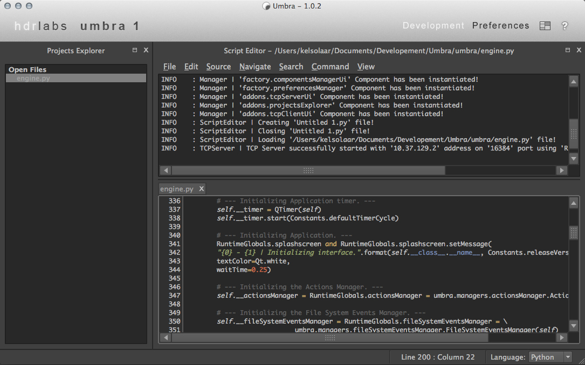

Umbra - Manual - Help File
================================

.. raw:: html

     

Table Of Content
=================

.. .tocTree

-  `Introduction`_
-  `Installation`_
-  `Usage`_
-  `Api`_
-  `Changes`_
-  `About`_

.. raw:: html

     

.. .introduction

_`Introduction`
===============

Umbra is the main package of `sIBL_GUI <http://github.com/KelSolaar/sIBL_GUI>`_ and `sIBL_Reporter <http://github.com/KelSolaar/sIBL_Reporter>`_.

.. raw:: html

     

.. .installation

_`Installation`
===============

The following dependencies are needed:

-  **Python 2.7.3**: http://www.python.org/
-  **PyQt**: http://www.riverbankcomputing.co.uk/

To install **Umbra** from the `Python Package Index <http://pypi.python.org/pypi/Umbra>`_ you can issue this command in a shell::

	pip install Umbra

or this alternative command::

	easy_install Umbra

Alternatively, if you want to directly install from `Github <http://github.com/KelSolaar/Umbra>`_ source repository::

	git clone git://github.com/KelSolaar/Umbra.git
	python setup.py install

If you want to build the documentation you will also need:

-  **Tidy** http://tidy.sourceforge.net/

.. raw:: html

     

.. .usage

_`Usage`
========

Once installed, you can launch **Umbra** using this shell command::

	Umbra

Please refer to `Umbra - Api <http://thomasmansencal.com/Sharing/Umbra/Support/Documentation/Api/index.html>`_ for precise usage examples.

.. raw:: html

     

.. .api

_`Api`
======

**Umbra** Api documentation is available here: `Umbra - Api <http://thomasmansencal.com/Sharing/Umbra/Support/Documentation/Api/index.html>`_

.. raw:: html

     

.. .changes

_`Changes`
==========

.. raw:: html

     

.. .about

_`About`
========

| *Umbra* by Thomas Mansencal - 2008 - 2012
| Copyright© 2008 - 2012 - Thomas Mansencal - `thomas.mansencal@gmail.com <mailto:thomas.mansencal@gmail.com>`_
| This software is released under terms of GNU GPL V3 license: http://www.gnu.org/licenses/
| http://www.thomasmansencal.com/